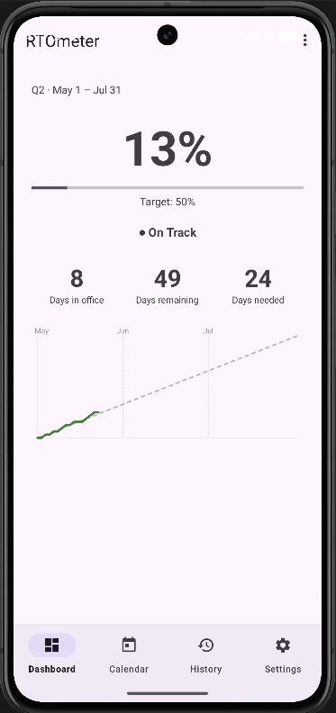
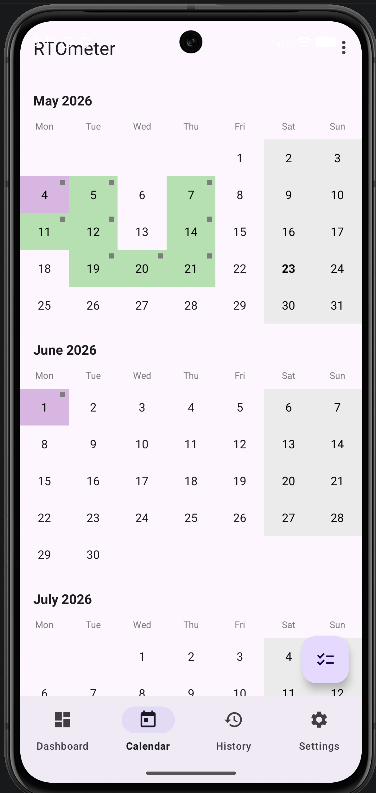
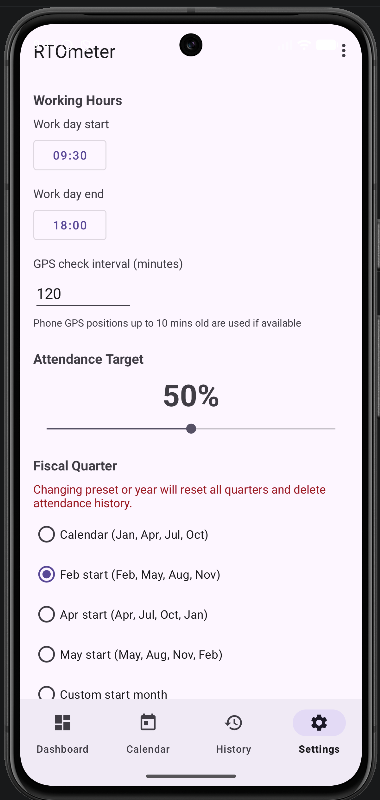

<p align="center">
  
</p>

<h1 align="center">RTOmeter</h1>

<p align="center">
  A personal Android app for tracking Return-to-Office attendance — built as an experiment in agentic development.
</p>

---

## Background

RTOmeter is a personal project born out of [Matt Pocock's agentic development workshop](https://youtu.be/-QFHIoCo-Ko?si=Pdf4OCbRT3AIyRic). The entire app was built through iterative AI-assisted development — each feature designed as a vertical slice, implemented via Red and Green TDD, and shipped through a structured agentic workflow — rather than writing code manually.

The practical motivation: an experiment in agentic development while automating my RTO tracking — with my office pre-configured as the default GPS geofence.

**This app is intended for my own personal use.** It is open source so anyone in a similar situation can fork it, swap in their own office location, and adapt the settings to their company's policy.

---

## Screenshots

<p align="center">
  
  &nbsp;&nbsp;
  
  &nbsp;&nbsp;
  
</p>

---

## Features

**Dashboard** — real-time attendance percentage for the current quarter, a Green / Amber / Red pace indicator, days-in-office count, days remaining, and days still needed to hit your target. A progress chart shows your actual pace vs. the required trajectory across the quarter.

**Calendar view** — month-by-month breakdown of the current quarter with colour-coded day statuses. Tap any day to set it manually to *In Office*, *Not in Office*, *Sick*, or *Holiday*.

**GPS geofencing** — set your office location and a geofence radius; WorkManager polls in the background and marks you in-office automatically when you arrive during working hours. Pre-configured for **my company's Dublin office**. Falls back gracefully to manual entry if location permission is not granted.

**Settings** — configure your attendance target (%), working hours, GPS check interval, and fiscal quarter. My company's default uses a **50 % quarterly target**.

**Quarterly history** — archive of past quarters with summary statistics so you can look back across the year.

**Mid-quarter pre-load** — enter historical attendance days when you first install, so the current quarter starts accurate.

**Fully local** — no account, no backend, no cloud sync. Everything lives on the device.

---

## Default configuration

| Setting | Value |
|---|---|
| Office location | My company's Dublin office |
| Attendance target | 50 % per quarter |
| Working hours | 09:30 – 18:00 |
| GPS check interval | 120 minutes |


## Requirements

- Android 8.0 (API 26) or higher
- Android Studio Hedgehog or later (AGP 8.7.3, Gradle 8.9)
- JDK 17

---

## Build and sideload

```bash
# Clone the repo
git clone https://github.com/czanotti/rtometer.git
cd rtometer

# Build a debug APK
./gradlew assembleDebug

# Install directly to a connected device or emulator
./gradlew installDebug
```

The resulting APK is at `app/build/outputs/apk/debug/app-debug.apk`. Transfer it to your device and open it to sideload.

---

## Customising for your office

1. Open **Settings** in the app and tap the office location field to enter your office address and adjust the geofence radius.
2. Set your company's **attendance target** and **fiscal quarter**.

No code changes required for the common case.

---

## License

MIT — see [LICENSE](LICENSE).
